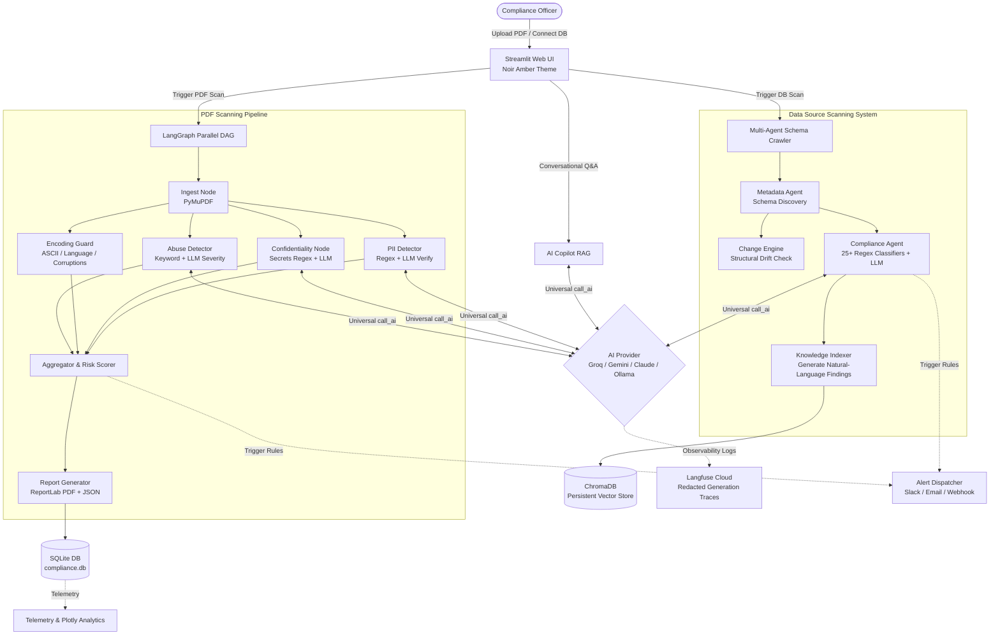
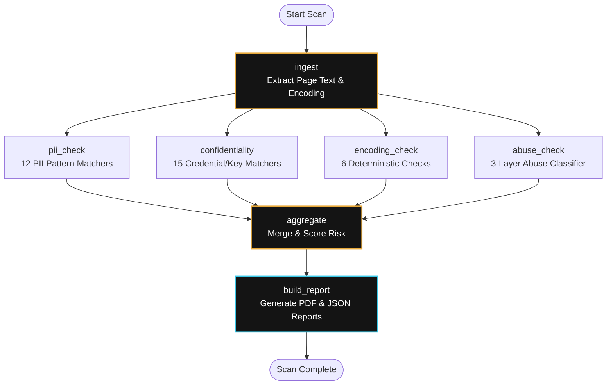
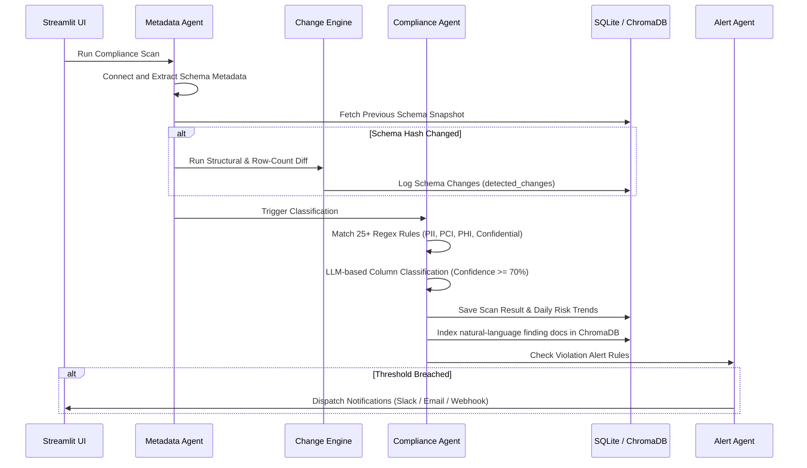

# 🛡️ Enterprise PDF & Data Source Compliance Scanner

[](https://www.python.org/)
[](https://streamlit.io/)
[](https://github.com/langchain-ai/langgraph)
[](https://www.trychroma.com/)
[](https://langfuse.com/)
[](https://www.docker.com/)

An AI-powered, enterprise-grade data and document compliance scanning platform. It features two distinct operational modes sharing a unified storage, vector search, alert infrastructure, and telemetry analytics dashboard, all wrapped in a sleek, custom **Noir Amber** dark-mode UI.

---

## 📌 Table of Contents
1. [Core Capabilities](#-core-capabilities)
2. [System Architecture](#%EF%B8%8F-system-architecture)
3. [Technology Stack](#%EF%B8%8F-technology-stack)
4. [Getting Started](#-getting-started)
5. [Environment & Configuration](#-environment--configuration)
6. [Observability & Testing](#-observability--testing)
7. [Database Schema](#-database-schema)

---

## 🚀 Core Capabilities

| Operational Mode / Feature | Description | Core Engine |
| :--- | :--- | :--- |
| **PDF Document Scanner** | Ingests PDF files and executes 4 parallel compliance nodes (PII, Confidentiality, Encoding, Abuse) under 30 seconds. | LangGraph DAG + PyMuPDF |
| **Data Source Scanner** | Classifies schema columns (PII/PHI/PCI), detects schema drift, and tracks compliance trends for 10+ databases/cloud warehouses. | Multi-Agent System + Rules Engine |
| **AI Copilot (RAG)** | Interactive conversational assistant retrieving compliance findings and querying live database metrics. | ChromaDB (Vector Store) + LLM |
| **Telemetry & Alerts** | Monitored token usages, scanning latencies, Slack/Email/Webhook threshold notifications with cooldowns. | Plotly + SMTP/Slack API |

---

## ⚙️ System Architecture

### 1. Architecture Diagram
<!-- ARCHITECTURE_DIAGRAM_PLACEHOLDER_START -->

<!-- ARCHITECTURE_DIAGRAM_PLACEHOLDER_END -->

For additional details, refer to the [documentations/architecture.md](file:///Users/as-mac-1320/Downloads/genai-capstone/pdf-compliance-scanner/documentations/architecture.md) specification file.

### 2. High-Level System Flow (Mermaid)



### 3. PDF Scan Pipeline (LangGraph DAG)



### 4. Data Source Compliance Scan Pipeline



---

## 🛠️ Technology Stack

*   **Frontend UI:** [Streamlit](https://streamlit.io/) (>= 1.55) - styled with custom **Noir Amber** CSS layout.
*   **Orchestration:** [LangGraph](https://github.com/langchain-ai/langgraph) (>= 1.1) for parallel compliance execution.
*   **Vector Database:** [ChromaDB](https://www.trychroma.com/) (>= 0.3) for Persistent Retrieval-Augmented Generation (RAG).
*   **Inference Abstraction:** Unified AI Gateway supporting runtime switching between **Groq**, **Google Gemini**, **Anthropic**, and local **Ollama** backends.
*   **Database:** Local SQL database using **SQLite** with WAL (Write-Ahead Logging) enabled.
*   **Parsing & Generation:** [PyMuPDF (fitz)](https://pymupdf.readthedocs.io/en/latest/) for extraction; [ReportLab](https://www.reportlab.com/) for PDF report building.
*   **Observability:** [Langfuse](https://langfuse.com/) (>= 2.0) for execution tracing, cost tracking, and token counting.

---

## ⚙️ Environment & Configuration

Configure your environment variables in the [.env](file:///Users/as-mac-1320/Downloads/genai-capstone/pdf-compliance-scanner/.env) file (use [.env.example](file:///Users/as-mac-1320/Downloads/genai-capstone/pdf-compliance-scanner/.env.example) as reference):

```bash
# Gateway Selection: groq | gemini | anthropic | ollama
AI_PROVIDER=groq

# AI Provider Credentials
GROQ_API_KEY=gsk_...
GOOGLE_API_KEY=AIza...
ANTHROPIC_API_KEY=sk-ant-...

# Observability Configuration
LANGFUSE_PUBLIC_KEY=pk-lf-...
LANGFUSE_SECRET_KEY=sk-lf-...
LANGFUSE_HOST=https://cloud.langfuse.com

# SMTP Email Alerts Configuration (Optional)
SMTP_HOST=smtp.gmail.com
SMTP_PORT=587
SMTP_USER=sender@example.com
SMTP_PASSWORD=app_password_here
```

### Supported Connectors (Lazy-Loaded)
The Data Source Scanner supports 10 distinct connectors. Note that the required packages are **lazy-loaded**; you only need to install what you use:
*   **Databases:** PostgreSQL (`psycopg2-binary`), MySQL (`pymysql`), MongoDB (`pymongo`), SQL Server (`pyodbc`).
*   **Cloud Stores:** AWS S3 (`boto3`), Azure ADLS Gen2 (`azure-storage-file-datalake`), Google Cloud Storage (`google-cloud-storage`).
*   **Warehouses:** Snowflake (`snowflake-connector-python`), BigQuery (`google-cloud-bigquery`), Databricks (`databricks-sql-connector`).

---

## 📦 Getting Started

### Prerequisites
*   Python 3.11+
*   pip / virtualenv

### 1. Local Setup
```bash
# Clone the repository
git clone https://github.com/YOUR_USERNAME/pdf-compliance-scanner.git
cd pdf-compliance-scanner

# Initialize virtual environment
python3 -m venv .venv
source .venv/bin/activate

# Install required dependencies
pip install -r requirements.txt

# Copy and update the environment template
cp .env.example .env
```

### 2. Run the Streamlit Application
```bash
streamlit run app/main.py
```
Access the dashboard at `http://localhost:8501`.

### 3. Docker Deployment
```bash
# Build and run using Docker Compose
docker-compose up --build
```
This mounts local volumes to persist reports in [reports](file:///Users/as-mac-1320/Downloads/genai-capstone/pdf-compliance-scanner/reports) and the SQLite database in `storage/`.

---

## 🔍 Observability & Testing

### Test Suite Execution
Run the unit and integration tests (which utilize mocked LLM responses):
```bash
pytest tests/ -v
```

### Observability Traces
*   All LLM calls are traced using the `@observe()` decorator via Langfuse.
*   Traces include execution latency, total token counts, and input/output schema.
*   **Privacy Guard:** Strict user data privacy is maintained; text inputs and outputs sent to LLMs are systematically replaced with `<redacted>` in the Langfuse traces, logging only token counts, execution states, and provider names.

---

## 🗄️ Database Schema

The SQLite database [storage/compliance.db](file:///Users/as-mac-1320/Downloads/genai-capstone/pdf-compliance-scanner/storage/compliance.db) consists of **12 core tables**:

### PDF Scanning
*   `scans`: Keeps historical records of scanned PDFs, status, risk parameters, token consumption, and report files.

### Data Source Scanning & Alerts
*   `data_sources`: Registry of configured databases, storage buckets, and warehouses.
*   `metadata_snapshots`: History of schema metadata structures and snapshot hashes.
*   `column_metadata`: Individual column structural configurations.
*   `detected_changes`: Tracked structural schema changes (new/dropped tables/columns).
*   `ds_scan_runs` & `ds_scan_results`: History of warehouse runs and identified columns.
*   `risk_trends` & `compliance_drift`: Daily aggregated compliance percentages and risk histories.
*   `alert_configs` & `alert_history`: Active channels, threshold rules, and alerts dispatch ledger.