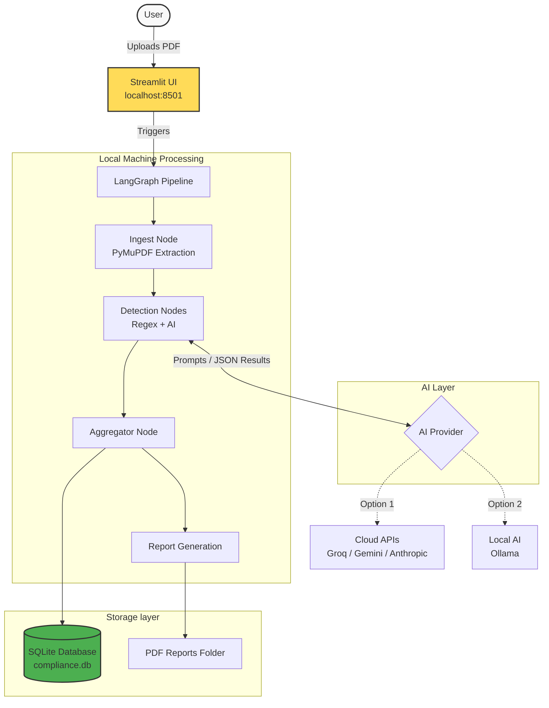
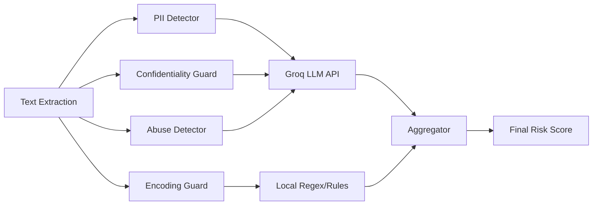

# Architecture Overview: PDF Compliance Scanner

The **PDF Compliance Scanner** operates as a **local web application**, not a browser plugin. 
When you run `streamlit run app/main.py`, it spins up a local web server on your machine. All your files and data are kept on your device, with the only external communication being the API calls to the AI models (unless you use a local AI model).

Here is a breakdown of the architecture:

## 1. Storage (Local)
The database is created and maintained **entirely on your device**. 
- It uses **SQLite** (`storage/compliance.db`), a lightweight, file-based database that requires no separate server setup.
- Scan metadata and results are stored locally, meaning no third party has access to your scan history.

## 2. Processing Engine (Local + Cloud AI)
The processing is split into two parts:
- **Local Execution:** Document ingestion (reading the PDF), text extraction (using `PyMuPDF`), regex-based scanning, LangGraph state management, and report generation all happen on your local CPU.
- **AI Inference (Cloud or Local):** The heavy lifting of semantic understanding (detecting context-based PII, abuse, or secrets) is outsourced to an LLM provider (like Groq, Gemini, or Claude) via API calls. However, if you configure it to use **Ollama**, even the AI inference happens 100% locally on your machine.

---

## Architecture Diagrams

### High-Level Architecture Flow

### Detection Node Breakdown

Here is a closer look at what happens inside the `Detection Nodes` step. The pipeline uses **LangGraph** to process multiple checks in parallel.

## Summary
- **Is it a plugin?** No, it is a standalone Python web app (Streamlit).
- **Where is the DB?** On your local hard drive (`storage/compliance.db`).
- **Where does processing happen?** 
  - Text extraction, rule checking, and report generation happen on your device.
  - The AI analysis runs on Groq's servers (by default), meaning the extracted text is temporarily sent to Groq for analysis. If you want 100% local privacy, you can switch the `AI_PROVIDER` to `ollama`.
