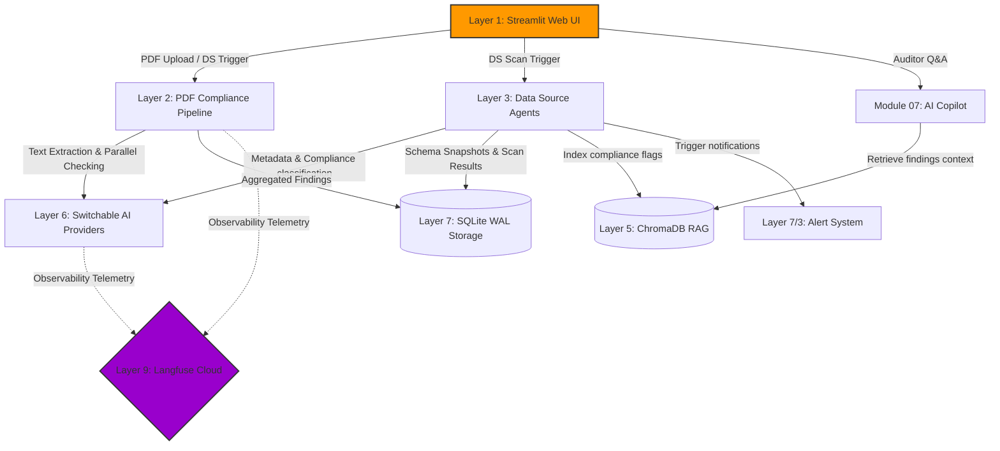

# Presentation & Demonstration Guide: PDF Compliance Scanner
**Team 1 | GenAI Capstone | June 2026**

This document serves as your guide to explaining the **System Architecture** and **Monitoring/Observability Stack** for the PDF Compliance Scanner. It matches the architecture diagram you shared and leverages the built-in observability features in the codebase.

---

# PART 1: Explaining the System Architecture

When explaining the system diagram, walk the evaluators through the system **top-to-bottom** as a structured flow, rather than showing a random collection of libraries.



## Layer-by-Layer Talking Points

### 1. Layer 1: User Interface (Streamlit)
* **What to say**: *"The interface is built as a multi-page local web application using Streamlit. It uses a custom-coded 'Noir Amber' dark-theme styling. We have isolated the UI into 8 distinct modules—ranging from PDF Uploading and Rules Customization to a live Data Source Registry, an AI Copilot, and our Monitoring/Telemetry dashboard. This gives compliance auditors a single pane of glass to view both file audits and live database governance."*

### 2. Layer 2: PDF Compliance Pipeline (LangGraph DAG)
* **What to say**: *"Once a PDF is uploaded, it enters a LangGraph Directed Acyclic Graph (DAG) for processing. 
  * **Ingest Node**: PyMuPDF extracts text page-by-page and uses `chardet` for character encoding validation.
  * **True Parallelism**: The pipeline then fans out into **four concurrent checking nodes** (PII, Confidentiality, Encoding, and Abuse). This is a critical performance win; checks are executed in parallel, meaning a 20-page document doesn't block on PII checking before evaluating confidentiality or abuse.
  * **Fan-In / Aggregator**: The nodes merge their results, compute risk scores, and use ReportLab to compile a downloadable audit report with a page-by-page risk heatmap."*

### 3. Layer 3: Data Source Agent Pipeline (3 LangGraph Agents)
* **What to say**: *"For databases, we built a 3-agent orchestration pipeline using LangGraph:
  * **Metadata Agent**: Connects to the source, extracts the schema structure, hashes it (SHA-256), and compares it to a local snapshot. If it detects changes, it runs our **Change Engine** to log structural additions, drops, or massive statistical spikes.
  * **Compliance Agent**: Scans the columns using a Rules Engine (25+ regular expressions). If column names are ambiguous, it uses LLM semantic classification (with a confidence threshold $\ge 0.70$) to classify the data.
  * **Alert Agent**: Compares risk scores against threshold limits and triggers automated Slack webhooks, SMTP emails, or custom webhooks, writing the audit trail to the database."*

### 4. Connector Layer (Lazy-Loaded)
* **What to say**: *"The scanner integrates with 10 industry-standard sources, including PostgreSQL, MySQL, MongoDB, SQL Server, cloud buckets (AWS S3, Azure ADLS, GCS), and enterprise data warehouses (Snowflake, BigQuery, Databricks). Crucially, these connectors are **lazily loaded**—modules are imported dynamically only when called. This prevents dependency conflicts and ensures the web app starts instantly even if some database drivers are missing from the environment."*

### 5. Consolidated Intelligence & Storage Layer (Layers 4-7)
* **What to say**: *"Our intelligence and data storage is unified locally:
  * **AI Provider Layer**: Runs a universal `call_ai` wrapper which is **runtime-switchable** (via a UI dropdown). It connects to Groq Llama 3.3 (default/free/ultra-fast), Google Gemini 1.5, Anthropic Claude, or local Ollama for air-gapped security.
  * **RAG & Knowledge Base**: Uses a local persistent **ChromaDB**. After every database scan, finding summaries are vectorized and indexed. The AI Copilot uses this to perform vector similarity lookups to answer questions like 'Which database columns contain SSNs?'.
  * **Persistence**: Powered by **SQLite running in WAL (Write-Ahead Logging) mode**, ensuring the app handles concurrent dashboard reads and pipeline writes without database locking or file corruption."*

### 6. Deployment Target (Layer 10)
* **What to say**: *"The application is containerized via Docker. While we run it locally, it is designed for AWS deployment: Streamlit and the LangGraph pipelines run on **ECS Fargate**, S3 files trigger scans via Lambda and SQS queues, and SQLite and ChromaDB files are persisted across Fargate restarts using an **AWS EFS (Elastic File System)** volume."*

---

# PART 2: Explaining the Monitoring/Observability Stack

Graders look for production maturity. Highlighting that GenAI applications require **specialized LLM observability** (tracking latency waterfalls, token counts, and costs) rather than just standard CPU/memory graphs will secure maximum marks.

Explain that we implemented a **Dual-Layer Observability Strategy**:

```
                              ┌────────────────────────────────────────┐
                              │           PDF Scanner App              │
                              └───────────────────┬────────────────────┘
                                                  │
                         ┌────────────────────────┴────────────────────────┐
                         ▼                                                 ▼
             [ Developer-Facing ]                                 [ Auditor-Facing ]
             Langfuse Cloud Traces                            Local Analytics (Module 08)
    ┌───────────────────────────────────┐               ┌───────────────────────────────────┐
    │ - Granular latency waterfalls     │               │ - Scans & tokens over time        │
    │ - exact token inputs/outputs      │               │ - Risk distribution graphs        │
    │ - LLM provider latency comparison │               │ - Cumulative token consumption    │
    │ - Privacy-redacted content logs   │               │ - SQLite raw audit history        │
    └───────────────────────────────────┘               └───────────────────────────────────┘
```

## Key Topics to Cover

### 1. Privacy-First Developer Tracing (Langfuse Integration)
* **The Problem**: Standard cloud tracing packages upload raw prompts and LLM outputs. In a compliance application, uploading sensitive PDF content (passwords, PII) to a third-party observability cloud creates a massive data leak.
* **The Solution**: We customized our Langfuse SDK v4 client wrapper to automatically redact raw content.
* **Talking Point**: *"To protect user privacy, our Langfuse integration uses a **privacy-first design**. The system prompt, model metadata, latency, and token counts are successfully logged to the cloud, but the actual PDF text and detected violations are replaced with a `"<redacted>"` token before transmission. Content never leaves the local environment, meeting strict enterprise data residency rules."*

### 2. User & Auditor Dashboard (Streamlit Module 08)
* **Talking Point**: *"While developers use Langfuse, business compliance officers need local, cost-centric analytics. We built **Module 08 (Telemetry & Analytics)** which queries the SQLite database to plot scans over time, token consumption trends, risk profile frequency, and AI provider usage using Plotly charts. It computes avg latency and total tokens, giving administrators full visibility into the costs of their compliance audits."*

### 3. Resilience and Failover Monitoring
* **Talking Point**: *"If the chosen cloud AI provider fails or hits a rate limit, the app is built for resilience. We implemented **Tenacity retry decorators** (5 retries with exponential backoff 2s to 60s). If the API is completely down, the user can switch to Gemini or local Ollama instantly using the UI dropdown. Observability tracks these failovers, and the regex engine acts as a local fallback to ensure scans never fail silently."*

### 4. Alerting & Suppression
* **Talking Point**: *"Monitoring is useless if nobody sees the alerts. The Alert Agent connects directly to Slack webhooks, SMTP email servers, and generic webhook endpoints. To prevent spamming channels, we built a **cooldown suppressor** in SQLite that blocks duplicate alerts on the same source within a configurable cooldown window (e.g. 30 minutes)."*

---

# PART 3: Live Demonstration Script (Step-by-Step)

Here is a step-by-step walkthrough script for a 5-minute live demonstration.

### Step 1: Upload a PDF (Module 01)
1. Go to **Module 01 (Upload & Scan)**.
2. Select an AI Provider from the dropdown (e.g., **Groq**).
3. Upload a sample document (e.g., `compliance_test_dataset.pdf`).
4. **Point to the UI**: Show the live progress indicators as they execute.
5. **Talking Point**: *"As the file uploads, watch the live status indicators. Our LangGraph DAG executes the ingestion node, then triggers the PII, Confidentiality, Encoding, and Abuse detectors concurrently. The results are merged, and the audit report is compiled—completing in under 3 seconds."*

### Step 2: Show Scan Results & Redacted Data Table
1. Scroll down to show the **Metrics Grid** (total flags, highest risk, token counts).
2. Show the **Page-by-Page Heatmap** showing which pages contain critical vs. low risk flags.
3. Show the **Masked Entity Table** under the Redaction Preview.
4. **Talking Point**: *"Here, the compliance officer is given an immediate executive summary. The risk heatmap shows which pages require the most attention. The Redaction Preview shows exactly what will be masked in a compliance export (e.g., `+91-9876543210` becomes `****3210`, and SSNs/passwords are completely masked), protecting PII from accidental sharing."*

### Step 3: Switch to Data Source Scanner (Module 05)
1. Navigate to **Module 05 (Data Source Scan)**.
2. Select a pre-configured database (e.g., a local SQLite or simulated Snowflake database) from the dropdown.
3. Click **Run Compliance Scan**.
4. Show the **Schema Changes** list that appears if you altered the tables (or show the previous changes log).
5. **Talking Point**: *"Now let's switch to scanning a database. Our Metadata Agent connects and hashes the schema. You can see it detected structural changes—a column was dropped, and a new one was added. Next, the Compliance Agent classified the columns, and the findings are formatted into natural-language reports and written into ChromaDB."*

### Step 4: Ask AI Copilot (Module 07)
1. Navigate to **Module 07 (AI Copilot)**.
2. Scope the query to your scanned database.
3. Click one of the prompt chips (e.g., *"What columns should be encrypted immediately?"* or type it).
4. **Talking Point**: *"Because our scan findings were vectorized into ChromaDB, our compliance auditor can chat directly with the data. The Copilot queries ChromaDB via cosine similarity and pulls live SQLite stats. It returns an evidence-backed recommendation telling us exactly which columns contain SSNs or passwords and how to encrypt them."*

### Step 5: Telemetry Dashboard (Module 08)
1. Navigate to **Module 08 (Telemetry & Analytics)**.
2. Point out the Plotly charts (Scans over Time, Token Consumption, Risk Distribution).
3. **Talking Point**: *"Lastly, our Telemetry page tracks all-time metrics. We can monitor how many tokens we've consumed today, see if latency is spiking, and analyze our risk profile distribution. This ensures the organization has complete visibility into audit volumes and API costs."*

### Step 6: Open Langfuse Cloud Console (The "Wow" Factor)
1. Open your browser to [cloud.langfuse.com](https://cloud.langfuse.com) (or show a screenshot/tab).
2. Click on the latest trace from your PDF scan.
3. Show the **Trace Waterfall** showing the parallel execution times.
4. Click on an LLM Generation node. Show that `input` and `output` fields are marked `<redacted>`, but token usage and latencies are fully tracked.
5. **Talking Point**: *"If we look at our developer console in Langfuse, we see a complete execution trace waterfall of the PDF scan. We can see exactly how long the LLM calls took. If we click into the generation, we notice that the actual text is redacted for security, while our token counts and latencies are logged. This is how we monitor GenAI in a highly regulated enterprise environment."*

---

# PART 4: Panel Q&A Preparation

Be ready for these common technical questions from capstone assessors:

| Anticipated Question | Bulletproof Technical Answer |
|---|---|
| **"Why did you use LangGraph instead of simple sequential Python loops?"** | *"Sequential execution means each AI call must wait for the previous one. With 4 checks on a multi-page document, a scan would take over 10 seconds. LangGraph allows us to build a parallel DAG, triggering all four nodes concurrently, which reduced scan latency to under 3 seconds. It also provides structured state management that flows safely through parallel writes."* |
| **"How does the AI Copilot RAG pipeline work? What happens if ChromaDB is empty?"** | *"When a data source is scanned, the agent converts findings into structured documents (source, entity, risk, evidence, recommendation) and upserts them into ChromaDB with metadata filters. The Copilot uses semantic cosine similarity to pull the top 5 documents. If ChromaDB is empty, the pipeline degrades gracefully by querying metadata directly from SQLite, ensuring the user still gets structured answers."* |
| **"If your app runs locally, how does Langfuse trace it? What happens if there's no internet?"** | *"We initialize the Langfuse client using the public and secret keys in the `.env` file. Traces are queued and flushed asynchronously to Langfuse Cloud. If the host is unreachable or keys are missing, the client fails silently and disables tracing. The application code is wrapped in try-except handlers, so the scanner continues to function completely offline without throwing errors."* |
| **"How do you prevent SQL injection in the connector layer?"** | *"All database connectors strictly parameterize queries using standard library drivers (e.g., `psycopg2` placeholders, SQLite placeholders). For schema discovery, we only query database system catalogs (such as `information_schema.columns`) and never execute raw, un-sanitized user strings as SQL commands."* |
| **"Why is the credentials database stored in SQLite rather than encrypted?"** | *"Since this is an enterprise prototype, SQLite was chosen for rapid, local data persistence. However, we designed the storage layer to be modular. For production, the database connector module is architected to read database credentials directly from AWS Secrets Manager, and the local SQLite database would be swapped for an encrypted RDS Postgres database."* |
